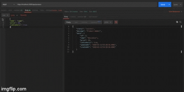

# BEER QUEEN - API

"Burger Queen" refere-se ao projeto desenvolvido durante o bootcamp da Laboratória, que tinha por obejtivo o aprendizado a construção de um _servidor web_, capaz de manejar as requisições que lhe são enviadas, devolvendo respostas ao cliente. 

***
## Índice 
1. [Resumo do Projeto](#1-resumo-do-projeto)
2. [Como Usar](#2-como-usar)
3. [Tecnologias Envolvidas](#3-tecnologias-do-projeto)
***
## 1. Resumo do Projeto

"Beer Queen" é o servidor web que pode ser futuramente implementa ao restaurante "God Save the Queen - Burger & Beer". 
O projeto consiste em um servidor web capaz de "ouvir" o que acontece em uma aplicação através de uma porta de rede, pela qual é possível enviar as _requests_ (requisições) e obter _responses_ (respostas), seguindo o modelo de arquitetura MVC (Model View Controller).
O projeto foi desenvolvido partindo de um _boilerplate_ fornecido que continha a estrutura básica. 
o final um resumo do pedido com o preço da conta final já calculado. 

***

### 2. Como Usar

***
## 3. Tecnologias e Ferramentas Envolvidas

Para o desenvolvimento do projeto foram utilizados: 

* NodeJs
* Docker
* Express
* Sequelize
* PostgreSQL (por meio do dBeaver)
* Postman
* Trello

***